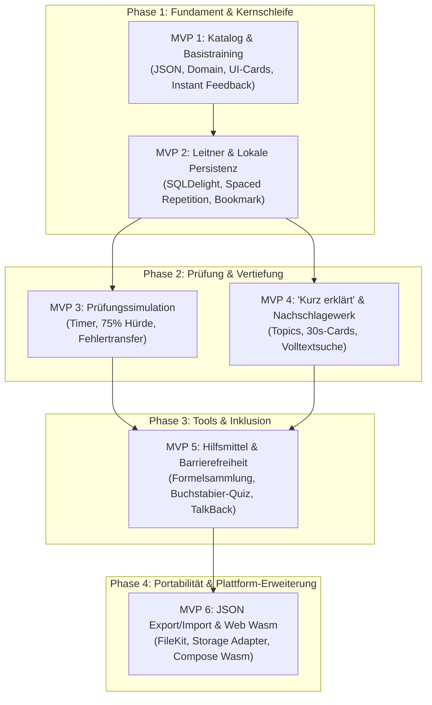

# Gesamt-Roadmap: Implementierungsplan über mehrere MVPs

## Lern-App für die Amateurfunkprüfung Klasse E (Deutschland)

Dieses Dokument bietet die übergeordnete Architektur- und Release-Roadmap zur schrittweisen Realisierung der in [srs_morseapp.md](file:///f:/Android/AmateurfunkTraining/Documentation/srs_morseapp.md) spezifizierten Anforderungen. Die Implementierung ist in sechs klar abgegrenzte, inkrementell testbare **Minimum Viable Products (MVPs)** unterteilt.

---

### 1. Phasen- und MVP-Übersicht

| MVP | Titel | Kernfokus | Erfüllte SRS-Anforderungen | Primäre Zielplattform |
|---|---|---|---|---|
| **MVP 1** | **Fragenkatalog & Basistraining** | JSON-Ingestion, Domain-Modell, interaktive Fragenkarten, Sofort-Feedback, einfacher Lernmodus, Kategoriefilter | F1.1, F1.3, F1.4, F4.1 (in-memory) | Android |
| **MVP 2** | **Leitner-System & Lernfortschritt** | SQLDelight-Persistenz, 5-Stufen-Spaced-Repetition, Fehlerzähler, Lesezeichen, Problemfragen-Training, Streak | F1.2, F1.5, F1.6, F4.1–F4.3, F7.1–F7.3 | Android |
| **MVP 3** | **Prüfungssimulation & Fehlertraining** | Realistische 3-Teile-Prüfung, Countdown-Timer, 75%-Bestehenskriterium, Auswertung, Prüfungsbereitschaft, Fehlertraining | F2.1, F2.2, F2.3, F2.4 | Android |
| **MVP 4** | **„Kurz erklärt“ & Themenlexikon** | Topic-Entität, Kontext-Hintergrundkarte (30s-Lesezeit), Nachschlagewerk mit Volltextsuche, Verlauf | F3.1, F3.2, F3.3, F3.4, F3.5 | Android |
| **MVP 5** | **Formelsammlung, Tools & Barrierefreiheit** | Formelsammlung, Q-Gruppen/Landeskenner, ITU-Alphabet-Quiz, Rechner, TalkBack-Optimierung, Dark Mode | F4.4, F6.1, F6.2, F6.3, F6.4, F6.5, F8.1–F8.3 | Android |
| **MVP 6** | **Datenportabilität & Web-Version (Wasm)** | JSON-Export/Import (SAF / FileKit), KMP Wasm-Projektsetup, Wasm-Storage (IndexedDB/localStorage), Web-Distribution | F5.1, F5.2, F5.3, F5.4, F9.1, F9.2, F9.3 | Android & Web (Wasm) |

---

### 2. Abhängigkeits- und Architektur-Graph

---

### 3. Technische Leitlinien & Architekturprinzipien

1. **Offline-First & Privacy-by-Design**:
   - Keine Netzwerkberechtigungen (`android.permission.INTERNET` ist im AndroidManifest nicht erforderlich).
   - Alle Fortschrittsdaten liegen in einer lokalen SQLite-Datenbank (SQLDelight) auf dem Endgerät.
2. **Saubere Schichtenarchitektur (Clean Architecture)**:
   - `core:model`: Reine Kotlin-Datenmodelle (`Question`, `Topic`, `Progress`, `ExamSession`).
   - `core:database`: SQLDelight-Datenbanktreiber, Queries und Schema-Migrationen.
   - `core:data`: Repositories (`QuestionRepository`, `ProgressRepository`, `ExamRepository`).
   - `feature:*`: Compose-Screens und ViewModels mit reaktiven `StateFlow`-Zuständen.
3. **Multiplatform-Readiness von Beginn an**:
   - Trennung von Plattformlogik (`commonMain` für Domain, Business-Logik, Compose UI).
   - Verwendung von Kotlin Multiplatform Bibliotheken (SQLDelight, kotlinx.serialization, FileKit).
4. **Performance & Responsiveness**:
   - Alle Lese- und Schreiboperationen laufen auf `Dispatchers.IO`.
   - UI-Renderzeiten unter 16 ms (60/120 fps) und Antwortzeiten bei Benutzerinteraktionen unter 100 ms.

---

### 4. Detaillierte Dokumentationsdateien

Für jeden MVP existiert ein eigenständiger, detaillierter Implementierungsplan mit User Stories, Akzeptanzkriterien, technischem Design, Teststrategie und Definition of Done:

1. [MVP 1: Fragenkatalog & Basistraining](file:///f:/Android/AmateurfunkTraining/Documentation/mvp_1_fragenkatalog_und_basistraining.md)
2. [MVP 2: Leitner-System & Lernfortschritt](file:///f:/Android/AmateurfunkTraining/Documentation/mvp_2_leitner_system_und_fortschritt.md)
3. [MVP 3: Prüfungssimulation & Fehlertraining](file:///f:/Android/AmateurfunkTraining/Documentation/mvp_3_pruefungssimulation_und_fehlertraining.md)
4. [MVP 4: „Kurz erklärt“ & Themenlexikon](file:///f:/Android/AmateurfunkTraining/Documentation/mvp_4_kurzerklaert_und_themenlexikon.md)
5. [MVP 5: Formelsammlung, Tools & Barrierefreiheit](file:///f:/Android/AmateurfunkTraining/Documentation/mvp_5_formelsammlung_tools_barrierefreiheit.md)
6. [MVP 6: Datenportabilität, Import/Export & Web (Wasm)](file:///f:/Android/AmateurfunkTraining/Documentation/mvp_6_import_export_und_web_wasm.md)
