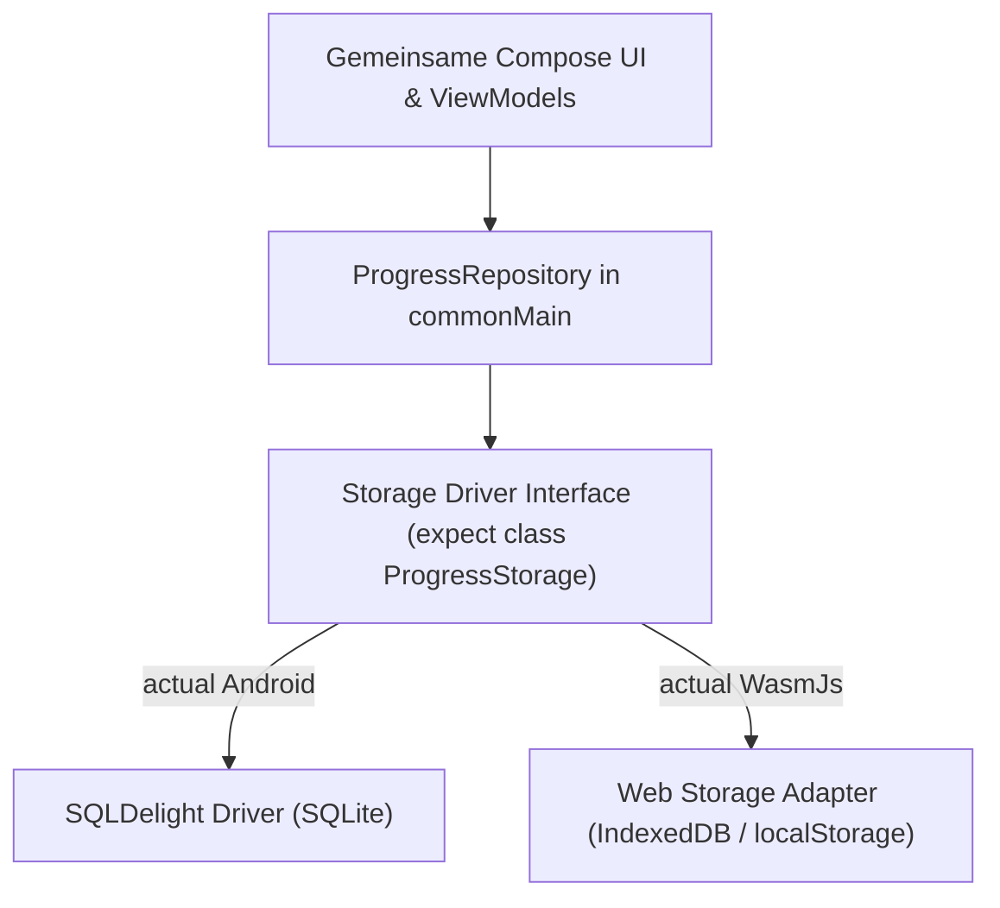

# Implementierungsplan: MVP 6 – Datenportabilität, Import/Export & Web (Wasm)

## 1. Zielsetzung & Umfang (Scope)

In **MVP 6** wird die App für maximale Plattformunabhängigkeit und Datensicherheit vollendet. Lernende können ihren gesamten Lernfortschritt, ihre Lesezeichen, Prüfungshistorien und Einstellungen als standardisierte, versionierte JSON-Datei exportieren und auf anderen Geräten wieder importieren (**Datenportabilität**). Auf Basis von **Compose Multiplatform (CMP)** wird die App zudem für das **Web (Wasm)** gebaut, sodass Nutzer direkt im Desktop-Browser ohne Installation lernen und ihre Daten nahtlos zwischen Smartphone und Web-App übertragen können.

### Erfüllte Anforderungen aus der SRS:
- **F5.1 & F5.2**: Vollständiger JSON-Export und Import aller Lerndaten.
- **F5.3**: Plattformübergreifende Dateioperationen via **FileKit** (auf Android über das Storage Access Framework SAF, im Web über HTML5 File API / File Download).
- **F5.4**: Plattformübergreifendes, strikt versioniertes JSON-Format.
- **F9.1**: Gemeinsame Codebasis (`commonMain`) zwischen Android und Web (Wasm).
- **F9.2 & F9.3**: Dedizierte Web-Persistenzlösung: Entkoppelung des Storage-Layers über eine `expect`/`actual`-Schnittstelle (`ProgressStorage`) mit `localStorage`/`IndexedDB` für Wasm und `SQLDelight` für Android.

---

## 2. Standardisiertes JSON-Export-Format (V1.0)

Das JSON-Schema ist strikt definiert, um Vorwärts- und Rückwärtskompatibilität zu gewährleisten:

```json
{
  "schema_version": "1.0",
  "app_version": "1.0.0",
  "exportiert_am": "2026-09-11T12:00:00Z",
  "client_platform": "Android",
  "lernstand": [
    {
      "frage_id": "TE-001",
      "status": "GEMEISTERT",
      "fehlerzaehler": 1,
      "letzte_antwort": 1726056000000,
      "leitner_box": 5,
      "ist_lesezeichen": true
    }
  ],
  "pruefungshistorie": [
    {
      "session_id": "exam_1726055000",
      "timestamp": 1726055000000,
      "duration_seconds": 3840,
      "technik_richtig": 29,
      "technik_gesamt": 34,
      "betrieb_richtig": 23,
      "betrieb_gesamt": 25,
      "vorschriften_richtig": 22,
      "vorschriften_gesamt": 25,
      "gesamt_bestanden": true
    }
  ],
  "einstellungen": {
    "dunkelmodus": true,
    "schriftgroesse": "normal",
    "pruefungs_timer_minuten": 150
  },
  "gelesene_themen": [
    "top_technik_lambda_f",
    "top_technik_ohmsches_gesetz"
  ],
  "streak": {
    "aktueller_streak": 7,
    "letzter_lerntag": "2026-09-11"
  }
}
```

---

## 3. Technische Architektur & Multiplatform-Design

### 3.1 Speicher-Abstraktion (`expect`/`actual`)



```kotlin
// commonMain
expect class StorageDriverFactory {
    fun createStorage(): ProgressStorage
}

interface ProgressStorage {
    suspend fun saveProgress(list: List<QuestionProgressRecord>)
    suspend fun loadProgress(): List<QuestionProgressRecord>
    suspend fun clearAll()
}
```

### 3.2 FileKit Integration
- **Android**: Nutzt `FileKit.saveFile(...)` und `FileKit.openFilePicker(...)`, welche intern die SAF-Intents `ACTION_CREATE_DOCUMENT` und `ACTION_OPEN_DOCUMENT` verwenden.
- **Web (Wasm)**: Generiert einen Browser-Blob-Download (`FileSaver`) bzw. öffnet das HTML `<input type="file">`.

---

## 4. Detaillierte Arbeitspakete (Work Packages)

### WP 6.1: Serialisierung & Import/Export-Service
- **Tasks**:
  1. Anlegen der DTOs für `AppBackupDto` mit `kotlinx.serialization`.
  2. Implementierung von `ExportManager`:
     - Liest sämtliche SQLite-Tabellen aus.
     - Serialisiert die Daten in einen formatierten JSON-String.
     - Berechnet optional einen SHA-256 Hash zur Integritätsprüfung.
  3. Implementierung von `ImportManager`:
     - Validiert das JSON-Schema und die Versionsnummer (`schema_version == "1.0"`).
     - Bietet zwei Modi: *Ersetzen* (Alle bisherigen Daten überschreiben) oder *Zusammenführen* (Merge: Behält die höhere Leitner-Box und den höheren Fehlerzähler).

### WP 6.2: UI-Integration für Backup & Wiederherstellung
- **Tasks**:
  1. **Einstellungen-Screen**: Sektion „Datensicherung & Synchronisation“:
     - Button `[ Lernstand exportieren (JSON) ]`: Öffnet System-Dateidialog mit Standarddateinamen `Amateurfunk_KlasseE_Backup_{YYYY-MM-DD}.json`.
     - Button `[ Lernstand importieren ]`: Zeigt Bestätigungsdialog vor dem Überschreiben/Zusammenführen.
     - Visuelles Feedback via Snackbar (z. B. *„Export erfolgreich gespeichert“* bzw. *„142 Lernstände importiert“*).

### WP 6.3: Kotlin Multiplatform Web-Target (Wasm)
- **Tasks**:
  1. Aktualisierung von `build.gradle.kts` zur Unterstützung des `wasmJs`-Targets:
     ```kotlin
     kotlin {
         androidTarget()
         wasmJs {
             browser {
                 binaries.executable()
             }
         }
     }
     ```
  2. Implementierung von `WasmLocalStorageProgressStorage`:
     - Nutzt `kotlinx.browser.localStorage` zur Speicherung des serialisierten JSON-Zustands bei jedem State-Update.
  3. Anpassung von Ressourcen (`compose.components.resources`) für webkompatibles Asset-Streaming der Fragenkataloge.

### WP 6.4: Web-Testing & Build-Distribution
- **Tasks**:
  1. Ausführung von `./gradlew wasmJsBrowserDistribution`.
  2. Bereitstellung der erzeugten Artefakte (`index.html`, `*.wasm`, `*.js`) in einem lokalen Test-Server.
  3. Verifikation der Responsiveness im Desktop- und Tablet-Browser.

---

## 5. UI/UX Spezifikation

```
+--------------------------------------------------------+
| Einstellungen: Datensicherung & Übertrag               |
+--------------------------------------------------------+
|                                                        |
|  [ Datensicherung (Backup) ]                           |
|  Sichere deinen Lernfortschritt als JSON-Datei.        |
|  Damit kannst du deine Daten auf ein anderes Handy     |
|  oder in die Web-Version übertragen.                   |
|                                                        |
|  [ 📤 LERNSTAND EXPORTIEREN ]                          |
|                                                        |
|  ----------------------------------------------------  |
|                                                        |
|  [ Wiederherstellung ]                                 |
|  Lade eine zuvor exportierte Backup-Datei.             |
|                                                        |
|  [ 📥 DATEI IMPORTIEREN ]                              |
|                                                        |
|  Import-Modus:                                         |
|  ( ) Bestehende Daten überschreiben                    |
|  (X) Intelligent zusammenführen (Empfohlen)            |
|                                                        |
+--------------------------------------------------------+
```

---

## 6. Test- und Verifikationsplan

### 6.1 Automatisierte Tests
| Test | Beschreibung |
|---|---|
| `BackupSerializationRoundtripTest` | Exportiert einen komplexen Datensatz (Progress, Exam History, Streaks, Bookmarks), serialisiert ihn zu JSON, deserialisiert ihn erneut und vergleicht die Gleichheit aller Objekte. |
| `ImportMergeStrategyTest` | Testet das Zusammenführen zweier Datensätze: Frage A (Box 2 auf Gerät 1, Box 4 auf Gerät 2) resultiert im Merge korrekt in Box 4. |
| `SchemaVersionCompatibilityTest` | Prüft, dass Backups mit inkompatibler Versionsnummer sauber mit einer verständlichen Fehlermeldung abgelehnt werden. |

### 6.2 Plattform- und Cross-Sync-Test
1. Auf Android 10 Fragen beantworten und 1 simulierte Prüfung ablegen.
2. JSON-Export durchführen und Datei auf PC übertragen.
3. Web-App (Wasm) im Browser starten.
4. JSON-Import im Browser ausführen: Alle 10 Lernstände, Prüfungsergebnisse und Statistiken müssen exakt identisch angezeigt werden.

---

## 7. Definition of Done (DoD)

- [ ] Exportierte JSON-Dateien sind 100 % valide und vollständig portabel.
- [ ] SAF-Integration auf Android und Datei-Download im Web funktionieren zuverlässig.
- [ ] Intelligente Merge-Strategie verhindert Datenverlust beim Zusammenführen.
- [ ] Compose Multiplatform Wasm Build kompiliert erfolgreich (`wasmJsBrowserDistribution`).
- [ ] Die Web-Version ist im modernen Browser (Chrome, Firefox, Safari) offline-fähig und flüssig bedienbar.
